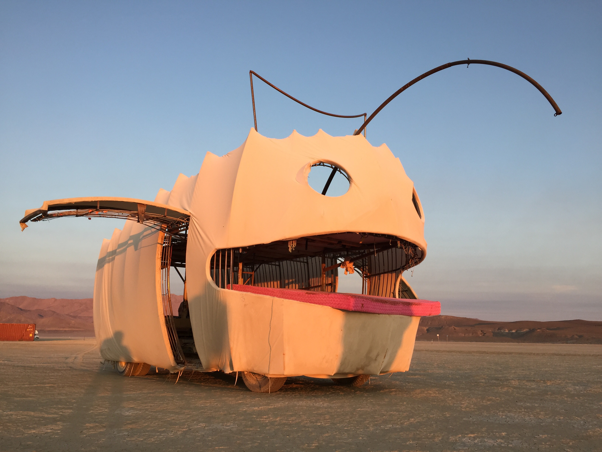
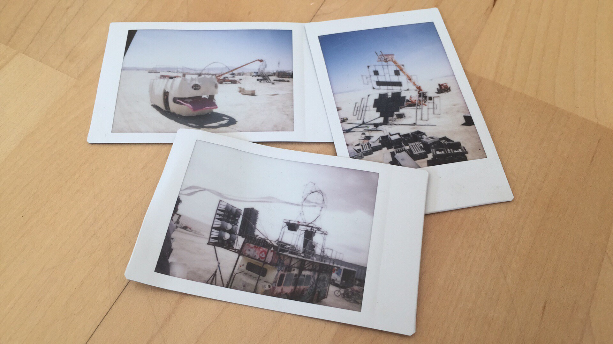

# Shady Bot art car

> A chapter of featherless' [digital creative history](https://github.com/featherless/digital-creative-history).

During Burning Man 2014 and 2015 I had the distinct joy of getting to work on the Shady Bot art car
as part of the Robot Heart camp.

In 2014 I helped rig the lights and learned how to use Madrix while on-playa with no internet
connection. And by learn, I mean poke around the interface until sunrise.

I didn't take many night time videos either year, but I managed to capture some fun shots of Shady
during build week when we were cruising around the empty playa.

# The tech

ShadyBot is a heavy duty pickup truck with a second upper deck and a tail welded to it.

ShadyBot has a generator that sits on its tail. It uses this generator to power the lights and sound
system.

The addressable LEDs are rigged vertically to the outer side of its exoskeleton and on the inside of
its scrim. There's about 6 inches of space to allow the LEDs to diffuse on the scrim's surface.

There is one [E682 controller](http://www.sandevices.com/E681info.html) for every 14 verticals.
These E682's are driven over ArtNet with [Madrix](http://www.madrix.com/). There is a single 24-port
switch connected to the 15 E682's. This switch also connects to the Mac mini running Madrix on
Windows.

Shady also has two eye holes through which we mount two projectors. We camp Shady in front of the
Bus so that Shady can look at the Bus the entire night with projection mapping.

# License

This repository and its contents are licensed under [CC BY 2.0](http://creativecommons.org/licenses/by/2.0/).

> A chapter of featherless' [digital creative history](https://github.com/featherless/digital-creative-history).
